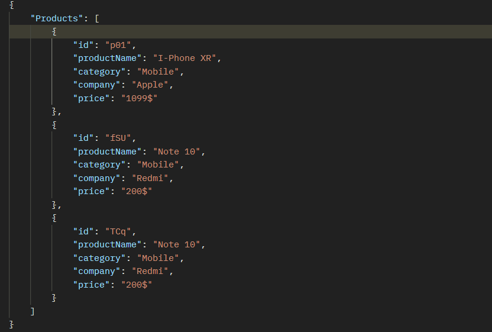
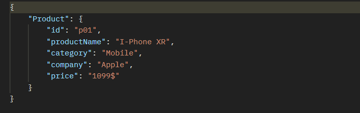
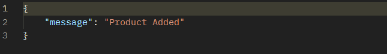
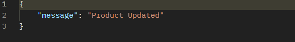
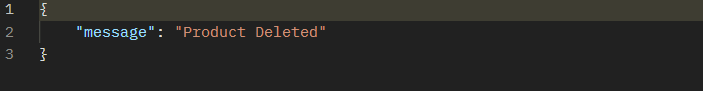
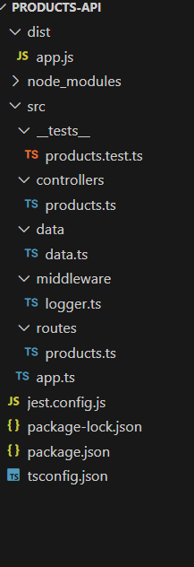

**[DOCUMENTATION FOR THE RETURN JOURNEY NODE.JS
ASSIGNMENT]{.underline}**

-   **[INTRODUCTION]{.underline}**

The Node.js Products API is designed to facilitate the management of
product-related data in a flexible and scalable manner. This API allows
you to perform various operations, such as retrieving a list of
products, adding new products, updating existing product details, and
deleting products.

-   **[INSTALLATION]{.underline}**

Steps needed to install this project locally:-

1.  Clone this Repository

2.  Change the directory to the project folder.

3.  Install dependencies with 'npm install' command.

4.  Run the project with "npm run" command.

-   **[REST APIs]{.underline}**

**Endpoints:**

1.  GET /api/products: Get a list of products.

2.  GET /api/products/:id: Get details of a specific product.

3.  POST /api/products: Create a new product.

4.  PUT /api/products/:id: Update details of a specific product.

5.  DELETE /api/products/:id: Delete a product.

**Authentication:**

As of this point, no authentication mechanism is implemented. No
authentication mechanism was needed as well.

**REQUEST AND RESPONSE**

All the responses are in JSON format.

1.  GET /api/products (STATUS: 200)

2.  GET /api/products/:id (STATUS: 200)

{width="6.9864916885389325in"
height="2.1937784339457567in"}

3.  POST /api/products (STATUS: 201)

{width="5.375465879265092in"
height="0.7500645231846019in"}

4.  PUT /api/products/:id (STATUS: 201)

{width="5.37547353455818in"
height="0.7083956692913386in"}

5.  DELETE /api/products/:id (STATUS: 200)

{width="5.433803587051618in"
height="0.7583989501312336in"}

-   **[FOLDER STRUCTURE]{.underline}**

{width="3.3942738407699036in"
height="3.791872265966754in"}

-   **[DEPENDENCIES]{.underline}**

1.  Express: Web framework for Node.js.

2.  Morgan: HTTP request logger middleware for node.js.

3.  Short-unique-id: Short unique id generator.

-   **[TESTING]{.underline}**

The libraries used for testing are: Jest and Supertest.

The Endpoints which are tested:

1.  GET /api/products

2.  GET /api/products/:id

3.  POST /api/products

4.  PUT /api/products/:id

5.  DELETE /api/products/:id

All the test cases were passed.
